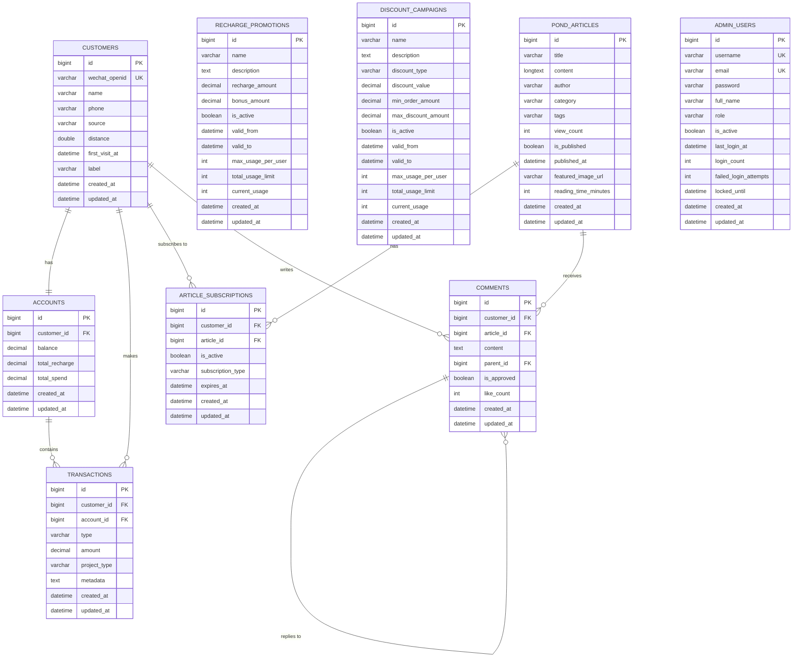

# Database Schema Documentation

## Entity Relationship Diagram (ERD)



## Entity Descriptions

### Core Entities

#### Customers
- **Purpose**: Stores customer information from WeChat integration
- **Key Fields**: 
  - `wechat_openid`: Unique identifier from WeChat
  - `source`: Customer acquisition channel (微信扫码, 朋友圈广告, etc.)
  - `label`: Custom labels for customer segmentation
  - `first_visit_at`: Initial customer visit timestamp
- **Indexes**: Optimized for common lookups (openid, phone, source, first visit date)

#### Accounts  
- **Purpose**: Manages customer financial balances and spending statistics
- **Key Fields**:
  - `balance`: Current available balance
  - `total_recharge`: Lifetime recharge amount
  - `total_spend`: Lifetime spending amount
- **Relationship**: One-to-one with customers (cascade operations)

#### Transactions
- **Purpose**: Records all financial transactions with comprehensive metadata
- **Key Fields**:
  - `type`: Transaction type enum (RECHARGE, SPEND, REFUND, ADJUSTMENT)
  - `project_type`: Business domain enum (GENERAL, POND_ARTICLES, etc.)
  - `metadata`: JSON string for flexible transaction context
- **Indexes**: Performance optimized for customer + date range queries

### Business Logic Entities

#### RechargePromotions
- **Purpose**: Manages promotional recharge offers with usage limits
- **Features**: 
  - Time-based validity periods
  - Per-user and total usage limits
  - Bonus amount calculations

#### DiscountCampaigns
- **Purpose**: Handles discount-based promotional campaigns
- **Features**:
  - Percentage or fixed amount discounts
  - Minimum order requirements
  - Maximum discount cap

### Content Management Entities

#### PondArticles
- **Purpose**: Stores educational and promotional content
- **Features**:
  - Rich content support with featured images
  - Publication workflow with approval states
  - Engagement metrics (view count, reading time)

#### ArticleSubscriptions
- **Purpose**: Manages customer subscriptions to premium content
- **Features**:
  - Multiple subscription types (FREE, PREMIUM, MONTHLY)
  - Expiration management
  - Unique constraint prevents duplicate subscriptions

#### Comments
- **Purpose**: User engagement system with nested comment support
- **Features**:
  - Hierarchical comment structure (parent-child relationships)
  - Moderation workflow (approval system)
  - Social engagement (like counts)

### Administrative Entities

#### AdminUsers
- **Purpose**: System administration and content moderation
- **Features**:
  - Role-based access control (ADMIN, MODERATOR, SUPPORT)
  - Security features (login tracking, account locking)
  - Password hashing support

## Database Design Principles

### 1. Performance Optimization
- Strategic indexing on frequently queried columns
- Composite indexes for complex query patterns (e.g., customer_id + created_at)
- Proper foreign key relationships with appropriate ON DELETE actions

### 2. Data Integrity
- Foreign key constraints maintain referential integrity
- Unique constraints on business identifiers (WeChat openid, usernames, emails)
- Proper data types and length constraints

### 3. Scalability Considerations
- Efficient data types (BIGINT for IDs, DECIMAL for financial data)
- Text fields for variable-length content (LONGTEXT for article content)
- Proper charset and collation (utf8mb4 for international support)

### 4. Flexibility
- JSON metadata fields for transaction context
- Label system for customer segmentation
- Extensible enum values for transaction and project types

## Migration Strategy

### Flyway Migrations
- `V1__Create_initial_schema.sql`: Creates all table structures with indexes and foreign keys
- `V2__Insert_seed_data.sql`: Populates reference data and sample records

### Seed Data Includes:
- **Customer Labels**: Examples of customer segmentation labels
- **Promotion Templates**: Reference promotion and discount campaign configurations
- **Content Samples**: Sample articles with various publication states
- **Transaction History**: Sample transactions showing all supported types
- **Admin Accounts**: Default administrative users for system setup

## Enum Mappings

### TransactionType
```sql
RECHARGE  -- Customer deposits money to account
SPEND     -- Customer purchases or uses services
REFUND    -- System returns money to customer
ADJUSTMENT -- Administrative balance adjustments
```

### ProjectType
```sql
GENERAL           -- General transactions
POND_ARTICLES     -- Article-related transactions
DISCOUNT_CAMPAIGN -- Discount-based purchases
PROMOTION         -- Promotional activities
SUBSCRIPTION      -- Subscription service payments
OTHER             -- Miscellaneous transactions
```

## Usage Guidelines

### 1. Entity Relationships
- Use cascade operations carefully, especially on customer deletion
- Consider the impact of foreign key constraints on bulk operations
- Leverage lazy loading for performance in collection relationships

### 2. Query Optimization
- Use the provided indexes for common query patterns
- Consider pagination for large result sets
- Utilize the repository query methods for complex operations

### 3. Data Management
- Implement proper error handling for transaction operations
- Use the mapper classes for clean DTO-entity conversion
- Follow the established naming conventions for new entities

## Setup Instructions

1. **Database Setup**: Create MySQL database `core_db`
2. **Configuration**: Update `application.properties` with your database credentials
3. **Run Migrations**: Spring Boot will automatically run Flyway migrations on startup
4. **Verify Setup**: Check that all tables are created and seed data is inserted
5. **Testing**: Run the application and verify entity mapping works correctly

## Future Considerations

### Potential Enhancements
- Audit trail tables for sensitive operations
- Data archival strategies for old transactions
- Partitioning strategies for large-scale data
- Read replicas for query performance
- Caching layer integration (Redis)

### Monitoring and Maintenance
- Regular index analysis and optimization
- Query performance monitoring
- Data growth monitoring and capacity planning
- Backup and disaster recovery procedures